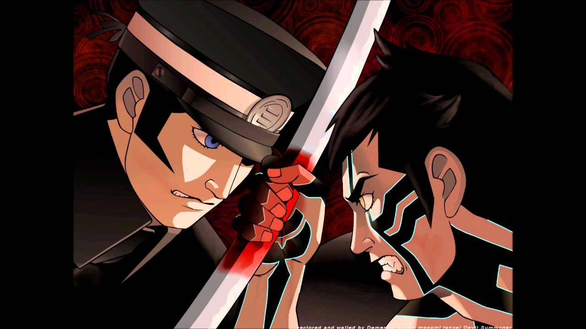

# SMT ROGUELIKE



**Descripción breve del juego**

[SMT RogueLike] es un Roguelike RPG de combate por turnos inspirado en la saga SHIN MEGAMI TENSEI. Sumérgete en un mundo oscuro y postapocalíptico lleno de demonios, toma decisiones difíciles y lucha por tu supervivencia.

## Características principales

- **Sistema de Combate por Turnos:** Disfruta de un sistema de combate estratégico basado en la saga SHIN MEGAMI TENSEI. Invoca y negocia con demonios para luchar a tu lado.

- **Proceduralidad:** Cada partida es única gracias a la generación procedural de niveles, lo que garantiza una experiencia fresca en cada juego.

- **Toma de Decisiones:** Las elecciones que tomes durante tu viaje afectarán el curso de la historia y el mundo que te rodea.

- **Arte y Música Atmosférica:** Sumérgete en un mundo visualmente impresionante y una banda sonora envolvente que te sumergirá en la atmósfera del juego.

## Cómo Jugar

**Exploración:** Navega por las mazmorras laberínticas mientras buscas tesoros y enemigos.
**Combate:** Entra en combate por turnos con monstruos y enemigos que encuentres. Elige tus acciones sabiamente, como atacar, defender o usar habilidades especiales.
**Inventario:** Recoge objetos, pociones y equipo para mejorar tus habilidades y tu supervivencia en las mazmorras.
**Progresión:** Gana experiencia y mejora tus habilidades a medida que avanzas en el juego. Derrota jefes para desbloquear nuevas áreas y desafíos.

## Instalación

[Proporciona instrucciones claras sobre cómo instalar y ejecutar el juego en diferentes plataformas, si es aplicable.]

## Contribuir

¡Las contribuciones son bienvenidas! Si deseas contribuir al desarrollo de [Nombre del Juego], sigue estos pasos:

1. [Fork](https://docs.github.com/en/get-started/quickstart/fork-a-repo) el repositorio en GitHub.

2. Clona tu repositorio [Nombre del Juego] fork en tu máquina local.

   ```bash
   git clone https://github.com/TU_USUARIO/[Nombre del Juego].git

## Créditos

* [Alejandro Lana](https://github.com/TU_USUARIO) - Desarrollador principal
* [Daniel Berzal](https://github.com/USUARIO_DEL_COLABORADOR) - Desarrollador principal 2
* [Hurto a mano armada de Internet](https://www.artista.com) - Arte y diseño
* [Algun compositor de internet](https://www.compositor.com) - Música y efectos de sonido

Agradecemos a todos los miembros del equipo y colaboradores que han contribuido a [SMT RogueLike].

## Licencia

Este proyecto está bajo la Licencia MIT - consulta el archivo [LICENSE.md](LICENSE.md) para obtener más detalles.

---

¡Disfruta jugando [SMT RogueLike]! Si tienes preguntas, problemas o sugerencias, no dudes en [crear un problema](https://github.com/TU_USUARIO/[SMT RogueLike]/issues) en este repositorio.

